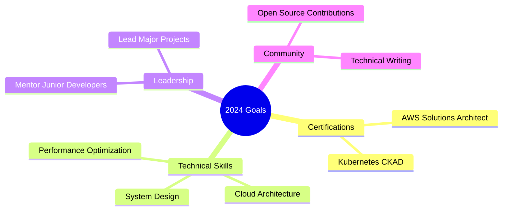

<div align="center">
  
</div>

<h1 align="center">
  
</h1>

<div align="center">
  
</div>

<div align="center">
  <a href="https://github.com/hoangtuanphong1a" target="_blank">
    
  </a>
  <a href="https://linkedin.com/in/yourprofile" target="_blank">
    
  </a>
  <a href="https://dev.to/yourprofile" target="_blank">
    
  </a>
  <a href="mailto:your.email@example.com">
    
  </a>
</div>

<br/>

<div align="center">
  
  
</div>

<br/>

## 🚀 About Me 

```javascript
const phong = {
  title: "Senior Frontend Developer",
  location: "Vietnam 🇻🇳",
  experience: "4+ years",
  education: "Computer Science Graduate 🎓",
  
  expertise: {
    frontend: ["React", "Next.js", "Vue.js", "TypeScript"],
    backend: ["Node.js", "NestJS", "Spring Boot"],
    mobile: ["React Native", "Flutter"],
    cloud: ["AWS", "GCP", "Firebase"],
    devOps: ["Docker", "K8s", "CI/CD"],
    architecture: ["Microservices", "Event-Driven", "DDD"]
  },
  
  certifications: [
    "AWS Certified Developer - Associate",
    "Meta Frontend Developer",
    "Google UX Design"
  ],
  
  passions: [
    "Clean Architecture",
    "Performance Optimization",
    "User Experience",
    "Open Source"
  ]
};
```

<div align="center">
  <h2>💻 Tech Stack</h2>
  <h3 align="left">Languages and Tools:</h3>
<p align="left"> <a href="https://getbootstrap.com" target="_blank" rel="noreferrer">  </a> <a href="https://www.chartjs.org" target="_blank" rel="noreferrer">  </a> <a href="https://www.w3schools.com/css/" target="_blank" rel="noreferrer">  </a> <a href="https://dart.dev" target="_blank" rel="noreferrer">  </a> <a href="https://www.djangoproject.com/" target="_blank" rel="noreferrer">  </a> <a href="https://flutter.dev" target="_blank" rel="noreferrer">  </a> <a href="https://git-scm.com/" target="_blank" rel="noreferrer">  </a> <a href="https://www.w3.org/html/" target="_blank" rel="noreferrer">  </a> <a href="https://www.java.com" target="_blank" rel="noreferrer">  </a> <a href="https://developer.mozilla.org/en-US/docs/Web/JavaScript" target="_blank" rel="noreferrer">  </a> <a href="https://www.mongodb.com/" target="_blank" rel="noreferrer">  </a> <a href="https://nodejs.org" target="_blank" rel="noreferrer">  </a> <a href="https://pugjs.org" target="_blank" rel="noreferrer">  </a> <a href="https://www.python.org" target="_blank" rel="noreferrer">  </a> <a href="https://reactjs.org/" target="_blank" rel="noreferrer">  </a> <a href="https://reactnative.dev/" target="_blank" rel="noreferrer">  </a> <a href="https://spring.io/" target="_blank" rel="noreferrer">  </a> <a href="https://www.typescriptlang.org/" target="_blank" rel="noreferrer">  </a> <a href="https://unity.com/" target="_blank" rel="noreferrer">  </a> </p>

## 📊 GitHub Statistics

<div align="center">
  
  
</div>

## 🎯 Current Focus



## 📈 Contribution Graph

[](https://github.com/ashutosh00710/github-readme-activity-graph)

## 🏆 Featured Projects

<div align="center">
  <a href="https://github.com/hoangtuanphong1a/project1">
    
  </a>
  <a href="https://github.com/hoangtuanphong1a/project2">
    
  </a>
</div>

## 📝 Latest Blog Posts

<div align="center">
  <table>
    <tr>
      <td>
        <a href="https://dev.to/yourpost1">🚀 Optimizing React Performance: Advanced Techniques</a>
      </td>
    </tr>
    <tr>
      <td>
        <a href="https://dev.to/yourpost2">🏗️ Building Scalable Frontend Architectures</a>
      </td>
    </tr>
    <tr>
      <td>
        <a href="https://dev.to/yourpost3">📘 Modern TypeScript Patterns in 2024</a>
      </td>
    </tr>
  </table>
</div>

<br/>

<div align="center">
  
</div>

<div align="center">
  
</div>

<div align="center">
  
</div>
