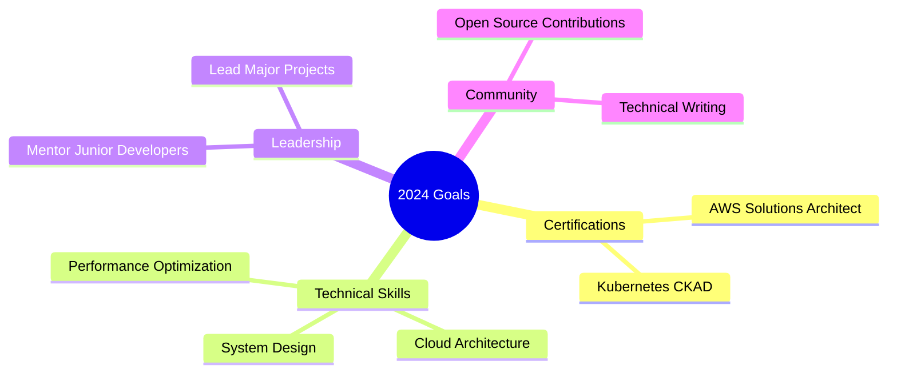

<h1 align="center">
  
</h1>

<div align="center">
  
</div>


<div align="center">
  <a href="https://github.com/hoangtuanphong1a" target="_blank">
    
  </a>
  <a href="https://linkedin.com/in/yourprofile" target="_blank">
    
  </a>
  <a href="https://dev.to/yourprofile" target="_blank">
    
  </a>
  <a href="mailto:your.email@example.com">
    
  </a>
</div>

<br/>

<div align="center">
  
  
</div>

<br/>


## 🚀 About Me 

```javascript
const phong = {
  title: "Final-year IT Student | Aspiring Software Engineer",
  location: "Vietnam 🇻🇳",
  status: "Final-year student (Graduation Project)",
  
  focus: [
    "Web Application Development",
    "AI-integrated Systems (Chatbot, NLP)",
    "Full-stack Project Implementation"
  ],

  skills: {
    frontend: [
      "ReactJS",
      "Next.js",
      "TailwindCSS",
      "TypeScript",
      "React-Bootstrap"
    ],
    backend: [
      "Node.js",
      "NestJS",
      "Spring Boot",
      "Django (REST Framework)"
    ],
    database: [
      "MySQL",
      "PostgreSQL",
      "MongoDB"
    ],
    devOps: [
      "Docker",
      "Docker Compose",
      "GitHub Actions (CI/CD)"
    ],
    cloud_tools: [
      "Firebase",
      "Vercel"
    ],
    fundamentals: [
      "OOP",
      "RESTful API Design",
      "Clean Code",
      "Basic System Design"
    ]
  },

  projects: [
    {
      name: "B2C Sales Platform with AI Chatbot",
      description: "Full-stack web application integrating an AI chatbot for automated customer support and product consultation."
    },
    {
      name: "AI-powered Personalized IELTS Learning System",
      description: "Web-based platform using AI/NLP to personalize IELTS practice and learning paths for individual users."
    },
    {
      name: "Task & Coffee Shop Management Systems",
      description: "Management systems built with React and backend APIs for task tracking, role-based access, and table management."
    }
  ],

  mindset: [
    "Learn by building real projects",
    "Focus on practical problem-solving",
    "Continuously improve technical and soft skills"
  ]
};

```
<div align="center">
  <h2>💻 Tech Stack</h2>
<!--   <h3 align="center">Languages and Tools:</h3> -->
  <div style="display: flex; flex-direction: column; gap: 20px;">
   <div align="center">

### 💻 Programming Languages


### 🎨 Frontend Technologies


### 🔧 Backend & DevOps


### ☁️ Cloud & Infrastructure


### 🧰 Development Tools


</div>

## 📊 GitHub Statistics

<div align="center">
  
  
</div>

## 🎯 Current Focus



## 📈 Contribution Graph

[](https://github.com/ashutosh00710/github-readme-activity-graph)

## 🏆 Featured Projects

<div align="center">
  <a href="https://github.com/hoangtuanphong1a/project1">
    
  </a>
  <a href="https://github.com/hoangtuanphong1a/project2">
    
  </a>
</div>

## 📝 Latest Blog Posts

<div align="center">
  <table>
    <tr>
      <td>
        <a href="https://dev.to/yourpost1">🚀 Optimizing React Performance: Advanced Techniques</a>
      </td>
    </tr>
    <tr>
      <td>
        <a href="https://dev.to/yourpost2">🏗️ Building Scalable Frontend Architectures</a>
      </td>
    </tr>
    <tr>
      <td>
        <a href="https://dev.to/yourpost3">📘 Modern TypeScript Patterns in 2024</a>
      </td>
    </tr>
  </table>
</div>

<br/>

<div align="center">
  
</div>

<div align="center">
  
</div>


<div align="center">
  
</div>
